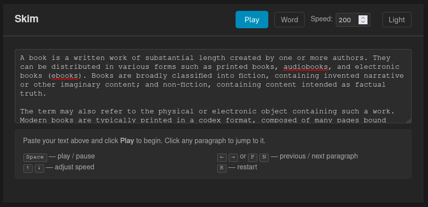

# Skim

A minimal, browser-based reading tool that guides your eyes through text by
highlighting one word (or character) at a time.

  

## Features

- **Word and character modes**: highlight a full word at a time (default) or character by character
- **Adjustable speed**: set the delay between highlights in milliseconds
- **Progress bar**: see how far through the text you are at a glance
- **Time remaining**: live countdown of estimated reading time left
- **Dark mode**: toggle-able, persisted across sessions
- **Keyboard shortcuts**: control everything without touching the mouse
- **Click to jump**: click any paragraph to start reading from there

## Usage

Open `index.html` in any modern browser.

Paste your text into the input area and click **Play**. If
you change the text, clicking Play again reloads it from
scratch. If the text is unchanged, Play/Pause toggles
playback.

## Keyboard Shortcuts

| Key | Action |
|-----|--------|
| `Space` | Play / pause |
| `←` / `P` | Previous paragraph |
| `→` / `N` | Next paragraph |
| `↑` | Decrease speed (slower) |
| `↓` | Increase speed (faster) |
| `R` | Restart from the beginning |

## License

This work is licensed under the GNU General Public License version 3 (GPLv3).

